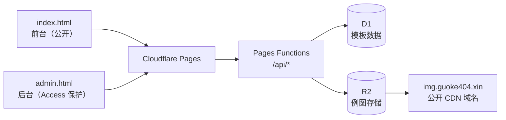

# Prompt Studio

<div align="center">

**面向「生图」与「文笔」两类创作场景的提示词工作台**

[](https://pages.cloudflare.com/)
[](https://developers.cloudflare.com/d1/)
[](https://developers.cloudflare.com/r2/)
[](.)
[](.)

浏览模板 · 编辑关键词 · 查看例图 · 实时预览 · 一键复制

</div>

---

## 目录

- [项目简介](#项目简介)
- [功能特性](#功能特性)
- [技术架构](#技术架构)
- [快速开始](#快速开始)
- [项目结构](#项目结构)
- [后端接口](#后端接口)
- [数据模型](#数据模型)
- [后台管理](#后台管理)
- [部署到 Cloudflare](#部署到-cloudflare)
- [开发注意事项](#开发注意事项)

---

## 项目简介

Prompt Studio 是一个纯静态的提示词管理工作台。内置两类创作模板（**生图** / **文笔**），你可以在前台挑选模板、填入关键词变量、实时预览最终提示词并复制使用；也可以在后台在线增删改模板、上传例图，保存后前台立即生效。

整个项目**没有构建步骤、没有框架、没有 npm 依赖** —— 改完文件直接部署，数据存在 Cloudflare D1，例图存在 Cloudflare R2。

- 线上站点：<https://guoke404.xin>
- 后台入口：<https://guoke404.xin/admin>（由 Cloudflare Access 保护）

---

## 功能特性

**前台**

- 按「生图 / 文笔 / 收藏」分类浏览模板
- 编辑模板中的关键词变量，实时生成提示词预览
- 查看模板例图，支持灯箱大图
- 一键复制最终提示词
- 收藏常用模板（状态存在浏览器本地）
- 三种排序：推荐优先（星级 → 时间）、名称 A-Z、最近新增
- 深色霓虹主题（生图 = 电青，文笔 = 琥珀）

**后台**

- 新增 / 复制 / 删除模板，编辑标题、分类、说明、正文
- 热度用 **8 星制** 点选，替代原来的 0-100 数字
- 例图拖拽式上传，自动命名存到 R2
- 保存时自动清理不再被引用的孤儿图片
- 保存前校验：同一张图被多个模板引用时会弹窗提示

---

## 技术架构



| 层 | 技术 | 说明 |
|---|---|---|
| 前端 | 原生 HTML / CSS / JavaScript | 无框架，无构建产物 |
| 托管 | Cloudflare Pages | 静态资源 + Functions 一体部署 |
| 数据 | Cloudflare D1 | SQLite，单表单行存整个 JSON 数组 |
| 图床 | Cloudflare R2 | 对象存储，绑定自定义域名公开访问 |
| 鉴权 | Cloudflare Access | 按路径保护后台页面与写接口 |

**读写走两条独立路径**：

- **读（匿名）**：前台先渲染内置兜底数据 → 再拉 `/api/templates` 覆盖 → 接口不可用时自动回退兜底，不会白屏
- **写（需登录）**：后台编辑内存态 → `POST /api/admin/templates` 提交整份数组 → D1 单行 UPSERT → 顺带清理 R2 孤儿图

---

## 快速开始

### 本地预览

项目是纯静态文件，起个本地服务器即可：

```bash
# 任选一种
python -m http.server 8080
npx serve .
```

打开 <http://localhost:8080> 查看前台，<http://localhost:8080/admin> 进入后台。

> 本地没有 Functions 环境，`/api/*` 接口不可用。此时前台和后台都会自动使用 `script.js` 里的内置兜底数据，功能可正常体验，只是改动无法保存到云端。

### 部署

```bash
npx wrangler pages deploy .
```

⚠️ 必须是 `pages deploy`（Pages 模式），**不要**用 `wrangler deploy`。后者走 Workers 模式，会忽略 `functions/` 目录，还会用本地配置覆盖 Dashboard 上手动添加的绑定。

---

## 项目结构

```
.
├── index.html            # 前台页面
├── script.js             # 前台逻辑 + 内置兜底种子数据
├── admin.html            # 后台页面
├── admin.js              # 后台逻辑（云端读写 / 例图上传）
├── styles.css            # 浅色基线样式
├── app-dark.css          # 前台深色霓虹覆盖层
├── admin-dark.css        # 后台深色霓虹覆盖层
├── functions/
│   └── api/
│       ├── templates.js        # GET  公开读全量
│       └── admin/
│           ├── templates.js    # POST 写全量（Access 保护）
│           ├── upload.js       # POST 上传例图到 R2
│           └── delete.js       # POST 批量删除 R2 对象
├── wrangler.toml         # 部署配置 + D1 / R2 绑定（必须入库）
└── README.md
```

---

## 后端接口

| 接口 | 方法 | 鉴权 | 说明 |
|---|---|---|---|
| `/api/templates` | GET | 公开匿名 | 返回全量模板数组；异常时返回 `[]`，前端回退兜底数据 |
| `/api/admin/templates` | POST | Cloudflare Access | 接收模板数组，整份覆盖写入 D1 |
| `/api/admin/upload` | POST | Cloudflare Access | `multipart/form-data`，字段：`file` / `slug` / `exampleIndex`；返回 `{ url }`。单图上限 1 MB |
| `/api/admin/delete` | POST | Cloudflare Access | `{ urls: [...] }`，批量删 R2 对象。只接受本站域名下的平铺文件名，外部域名与路径穿越会被忽略 |

> **为什么读写要拆路径？** Cloudflare Access 按路径拦截、不区分 HTTP 方法。如果读写共用一个路径，前台匿名 GET 也会被一起挡掉。

---

## 数据模型

D1 只有一张表、一行记录，整个模板数组序列化成一个 JSON 字段：

```sql
CREATE TABLE IF NOT EXISTS templates (
  id   INTEGER PRIMARY KEY,
  data TEXT NOT NULL
);
```

单条模板的结构：

```json
{
  "id": "template-mq3l8bmm-4578a",
  "title": "半条命画风",
  "category": "生图",
  "description": "",
  "popularity": 4,
  "date": "2026-06-07",
  "variables": { "主题": "你的主题" },
  "examples": [{ "src": "https://img.guoke404.xin/tm4578a-1.webp" }],
  "prompt": "严格基于参考图进行风格转换…"
}
```

字段说明：

| 字段 | 说明 |
|---|---|
| `category` | 只能是 `生图` 或 `文笔` |
| `popularity` | 热度，**1-8 星**，缺省 4 星 |
| `variables` | 关键词变量，键会被替换进 `prompt` 里的 `{{键名}}` |
| `examples` | 例图 URL 数组 |

---

## 后台管理

访问 `/admin`（Access 保护）后可增删改模板，点「保存到云端」写入 D1，前台下次加载即生效。

### 例图命名规则

上传的例图会自动命名为：

```
t{模板短码}-{例图序号}.{扩展名}
```

- **模板短码**：取模板 `id` 末尾 6 位字母数字，例如 `template-mq3l8bmm-4578a` → `m4578a`
- **例图序号**：该模板下的第几张，从 1 起
- 例：`https://img.guoke404.xin/tm4578a-2.webp`

> ⚠️ 短码绑定的是 **id，不是列表位置**。早期版本用「模板在数组中的第几位」当序号，结果新增模板被插到最前、所有位置下移，新模板就复用了别的模板正在用的文件名，直接把对方的图覆盖掉。改绑 id 之后，增删、排序、改名都不会让文件名漂移。

配套的三道保险：

1. 上传时若候选文件名已被**其它模板**引用，自动跳到下一个空闲序号
2. 保存前检测「一图多模板引用」，弹窗列出明细，确认后才写入
3. 服务端 `safeSlug()` 过滤非字母数字，杜绝路径穿越

### 图片压缩

上传接口有 **1 MB** 体积限制。PNG 原图动辄 1-3 MB，建议先转 WebP：

```bash
ffmpeg -i 原图.png -q:v 78 输出.webp
```

质量 78 是画质与体积的平衡点，实测可压缩掉 90%+。

---

## 部署到 Cloudflare

### 1. 创建 D1 数据库

```bash
npx wrangler d1 create prompt-templates
```

把返回的 `database_id` 填进 `wrangler.toml`，然后建表：

```bash
npx wrangler d1 execute prompt-templates --remote \
  --command "CREATE TABLE IF NOT EXISTS templates (id INTEGER PRIMARY KEY, data TEXT NOT NULL);"
```

### 2. 创建 R2 存储桶

在 Dashboard 建一个 bucket（本项目用 `prompt-examples`），在 **Settings → Custom Domains** 绑定一个公开域名（本项目用 `img.guoke404.xin`）。

> 若改用别的域名，需要同步修改 `functions/api/admin/upload.js` 里的 `PUBLIC_BASE` 和 `admin.js` 里的 `IMAGE_BASE`。

### 3. 配置 Cloudflare Access

在 Zero Trust 里创建 Access Application，保护两条路径：

- `/admin*`
- `/api/admin*`

**不要**保护 `/api/templates`，否则前台匿名访问会被挡。

### 4. 部署

```bash
npx wrangler pages deploy .
```

首次部署后，在后台点一次「保存到云端」，即可把内置模板写入 D1。

---

## 开发注意事项

### ⚠️ 改 JS / CSS 必须升版本号

Cloudflare Pages 的缓存策略不一致：

| 资源 | 缓存头 | 表现 |
|---|---|---|
| HTML | `max-age=0, must-revalidate` | 每次都拿最新 |
| JS / CSS | `max-age=14400` | 浏览器缓存 4 小时 |

改动 JS 或 CSS 后，如果不把 `index.html` / `admin.html` 里静态资源的 `?v=` 版本号 +1，用户浏览器会拿到「**新 HTML + 旧 JS**」。一旦新版 HTML 删掉了某个 id，旧脚本里无保护的事件绑定就会抛错，导致整页空白 —— **但云端数据是完好的**。

### 排查「页面空白」的顺序

1. 先确认数据没丢：`curl -s "https://guoke404.xin/api/templates?_=$(date +%s)"`
2. 数据还在 → 一定是前端脚本崩了 → 检查缓存头与版本号
3. 交叉校验 HTML 里的 `id` 与 JS 里的 `querySelector("#xxx")`
4. 脚本崩溃时页面顶部会显示红色提示条，按 `Ctrl+Shift+R` 硬刷新即可恢复

### 两个页面共享顶层作用域

后台页面会同时加载 `script.js` 和 `admin.js`，两者在同一个全局作用域里。**新增工具函数时必须先在两个文件里查重**，否则 `const` 重复声明会直接 `SyntaxError` 白屏。

### 排查「图片显示不对」

1. 拉 `/api/templates` 看数据引用的是哪些 URL
2. **比对 MD5，不要只看 `content-length`** —— 大小相同不代表内容相同
3. 加 `Cache-Control: no-cache` 再取一次，区分「CDN 缓存脏」与「源文件错」
4. 遍历数据，检测「同一 URL 被多个模板引用」

---

<div align="center">

用 ❤️ 和 Cloudflare 搭的提示词小工具

</div>
