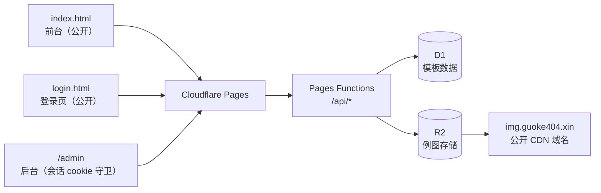

# Prompt Studio

<div align="center">

**面向「生图」与「文笔」两类创作场景的提示词工作台**

[](https://pages.cloudflare.com/)
[](https://developers.cloudflare.com/d1/)
[](https://developers.cloudflare.com/r2/)
[](.)
[](.)

浏览模板 · 编辑关键词 · 查看例图 · 实时预览 · 一键复制

</div>

---

## 目录

- [项目简介](#项目简介)
- [功能特性](#功能特性)
- [技术架构](#技术架构)
- [快速开始](#快速开始)
- [项目结构](#项目结构)
- [后端接口](#后端接口)
- [数据模型](#数据模型)
- [后台管理](#后台管理)
- [部署到 Cloudflare](#部署到-cloudflare)
- [开发注意事项](#开发注意事项)

---

## 项目简介

Prompt Studio 是一个纯静态的提示词管理工作台。内置两类创作模板（**生图** / **文笔**），你可以在前台挑选模板、填入关键词变量、实时预览最终提示词并复制使用；也可以在后台在线增删改模板、上传例图，保存后前台立即生效。

整个项目**没有构建步骤、没有框架、没有 npm 依赖** —— 改完文件直接部署，数据存在 Cloudflare D1，例图存在 Cloudflare R2。

- 线上站点：<https://guoke404.xin>
- 后台入口：<https://guoke404.xin/admin>（由 Cloudflare Access 保护）

---

## 功能特性

**前台**

- 按「生图 / 文笔 / 收藏」分类浏览模板
- 编辑模板中的关键词变量，实时生成提示词预览
- 查看模板例图，支持灯箱大图
- 一键复制最终提示词
- 收藏常用模板（状态存在浏览器本地）
- 三种排序：推荐优先（星级 → 时间）、名称 A-Z、最近新增
- 深色霓虹主题（生图 = 电青，文笔 = 琥珀）

**后台**

- 管理员密码登录（HMAC 会话 cookie，7 天有效），同一 IP 15 分钟内失败 5 次触发限速
- 新增 / 复制 / 删除模板，编辑标题、分类、说明、正文
- 热度用 **8 星制** 点选，替代原来的 0-100 数字
- 例图拖拽式上传，自动命名存到 R2
- 保存时自动清理不再被引用的孤儿图片
- 保存前校验：同一张图被多个模板引用时会弹窗提示

---

## 技术架构



| 层 | 技术 | 说明 |
|---|---|---|
| 前端 | 原生 HTML / CSS / JavaScript | 无框架，无构建产物 |
| 托管 | Cloudflare Pages | 静态资源 + Functions 一体部署 |
| 数据 | Cloudflare D1 | SQLite，单表单行存整个 JSON 数组 |
| 图床 | Cloudflare R2 | 对象存储，绑定自定义域名公开访问 |
| 鉴权 | 自建管理员登录 | 密码登录签发 HMAC 会话 cookie，Functions 中间件守卫后台 |

**读写走两条独立路径**：

- **读（匿名）**：前台先渲染内置兜底数据 → 再拉 `/api/templates` 覆盖 → 接口不可用时自动回退兜底，不会白屏
- **写（需登录）**：后台编辑内存态 → `POST /api/admin/templates` 提交整份数组 → D1 单行 UPSERT → 顺带清理 R2 孤儿图

---

## 快速开始

### 本地预览

项目是纯静态文件，起个本地服务器即可：

```bash
# 任选一种
python -m http.server 8080
npx serve .
```

打开 <http://localhost:8080> 查看前台，<http://localhost:8080/admin> 进入后台。

> 本地没有 Functions 环境，`/api/*` 接口不可用。此时前台和后台都会自动使用 `script.js` 里的内置兜底数据，功能可正常体验，只是改动无法保存到云端。

### 部署

```bash
npx wrangler pages deploy .
```

⚠️ 必须是 `pages deploy`（Pages 模式），**不要**用 `wrangler deploy`。后者走 Workers 模式，会忽略 `functions/` 目录，还会用本地配置覆盖 Dashboard 上手动添加的绑定。

---

## 项目结构

```
.
├── index.html            # 前台页面
├── script.js             # 前台逻辑
├── admin.html            # 后台页面
├── admin.js              # 后台逻辑（云端读写 / 例图上传）
├── login.html            # 后台登录页（独立页，不加载 script.js）
├── styles.css            # 浅色基线样式
├── app-dark.css          # 前台深色霓虹覆盖层
├── admin-dark.css        # 后台深色霓虹覆盖层
├── _redirects            # /admin.html → /admin 301（直链收口到守卫）
├── functions/
│   ├── admin.js                # GET /admin 页面守卫（验会话，失败跳登录页）
│   └── api/
│       ├── templates.js        # GET  公开读全量
│       └── admin/
│           ├── _auth.js        # 共享鉴权工具（验签 / PBKDF2 / 常量时间比较）
│           ├── _middleware.js  # /api/admin/* 统一守卫（login / logout 白名单）
│           ├── login.js        # POST 登录（验密码 + 签发 cookie + 失败限速）
│           ├── logout.js       # POST 退出（清 cookie）
│           ├── session.js      # GET  登录态探测
│           ├── templates.js    # POST 写全量
│           ├── upload.js       # POST 上传例图到 R2
│           └── delete.js       # POST 批量删除 R2 对象
├── wrangler.toml         # 部署配置 + D1 / R2 绑定（必须入库）
└── README.md
```

---

## 后端接口

| 接口 | 方法 | 鉴权 | 说明 |
|---|---|---|---|
| `/api/templates` | GET | 公开匿名 | 返回全量模板数组；异常时返回 `[]`，前端回退兜底数据 |
| `/api/admin/login` | POST | 公开（限速） | `{ password }`，验密码后签发会话 cookie；同 IP 15 分钟内失败 5 次返回 429 |
| `/api/admin/logout` | POST | 无需登录 | 清除会话 cookie |
| `/api/admin/session` | GET | 会话 cookie | 登录态探测：200 = 已登录，401 = 未登录/过期 |
| `/api/admin/templates` | POST | 会话 cookie | 接收模板数组，整份覆盖写入 D1 |
| `/api/admin/upload` | POST | 会话 cookie | `multipart/form-data`，字段：`file` / `slug` / `exampleIndex`；返回 `{ url }`。单图上限 1 MB |
| `/api/admin/delete` | POST | 会话 cookie | `{ urls: [...] }`，批量删 R2 对象。只接受本站域名下的平铺文件名，外部域名与路径穿越会被忽略 |

> 守卫统一在 `functions/api/admin/_middleware.js`：除 login / logout 两个白名单外，验签不通过一律 401，请求到不了各个接口。`/admin` 页面本身由 `functions/admin.js` 守卫，未登录 302 到登录页；`admin.html` 直链被 `_redirects` 301 收口到 `/admin`，无法绕过。

> **为什么读写要拆路径？** 历史原因是 Cloudflare Access 按路径拦截、不区分 HTTP 方法，读写共用路径会把前台匿名 GET 一起挡掉。现在换成自建登录，这个拆分保留下来还顺带成了权限边界：守卫中间件只挂在 `/api/admin/*` 上，公开读接口完全不受影响。

---

## 数据模型

D1 只有一张表、一行记录，整个模板数组序列化成一个 JSON 字段：

```sql
CREATE TABLE IF NOT EXISTS templates (
  id   INTEGER PRIMARY KEY,
  data TEXT NOT NULL
);
```

另有一张 `login_attempts` 表（`ip`、`ts` 两列），由登录接口首次调用时自动创建，用于登录失败限速，与模板数据无关。

单条模板的结构：

```json
{
  "id": "template-mq3l8bmm-4578a",
  "title": "半条命画风",
  "category": "生图",
  "description": "",
  "popularity": 4,
  "date": "2026-06-07",
  "variables": { "主题": "你的主题" },
  "examples": [{ "src": "https://img.guoke404.xin/tm4578a-1-mtf8n67ec96f75c9.webp" }],
  "prompt": "严格基于参考图进行风格转换…"
}
```

字段说明：

| 字段 | 说明 |
|---|---|
| `category` | 只能是 `生图` 或 `文笔` |
| `popularity` | 热度，**1-8 星**，缺省 4 星 |
| `variables` | 关键词变量，键会被替换进 `prompt` 里的 `{{键名}}` |
| `examples` | 例图 URL 数组 |

---

## 后台管理

访问 `/admin`（需管理员登录，未登录会 302 到 `/login`）后可增删改模板，点「保存到云端」写入 D1，前台下次加载即生效。

### 例图命名规则

上传的例图会自动命名为：

```
t{模板短码}-{例图序号}-{唯一令牌}.{扩展名}
```

- **模板短码**：取模板 `id` 末尾 6 位字母数字，例如 `template-mq3l8bmm-4578a` → `m4578a`
- **例图序号**：该模板下的第几张，从 1 起
- **唯一令牌**：服务端生成（时间戳 + 随机数），保证每次上传都是全新地址
- 例：`https://img.guoke404.xin/tm4578a-2-mtf8n67qcfb4dea1.webp`

**为什么带唯一令牌？** 因为一个地址的内容一旦永不变，浏览器和 CDN 就能放心强缓存。少了它，替换图片时 R2 虽然更新了，但各级缓存不会失效，用户看到的还是旧图。加上令牌后「替换」变成「新增一份新地址的文件」，缓存天然不可能脏。

配套的保险：

1. 短码绑定 **id 而非列表位置**，增删、排序、改名都不会让文件名漂移
2. 保存前检测「一图多模板引用」，弹窗列出明细，确认后才写入
3. 服务端 `safeSlug()` 过滤非字母数字，杜绝路径穿越
4. **孤儿自动回收**：替换或删除例图后，旧文件会在保存时按差集自动从 R2 删掉

> 历史演进（都是踩过的坑）：最早用「模板在数组中的位置」当序号 → 新增模板插到最前会让位置整体下移，新模板复用到别人的文件名，把对方的图直接覆盖掉；改成绑 id 后，又因为覆盖同名对象不触发缓存失效，导致换了图页面还显示旧的。现在这套是第三个版本。

### 图片压缩

上传接口有 **1 MB** 体积限制。PNG 原图动辄 1-3 MB，建议先转 WebP：

```bash
ffmpeg -i 原图.png -q:v 78 输出.webp
```

质量 78 是画质与体积的平衡点，实测可压缩掉 90%+。

---

## 部署到 Cloudflare

### 1. 创建 D1 数据库

```bash
npx wrangler d1 create prompt-templates
```

把返回的 `database_id` 填进 `wrangler.toml`，然后建表：

```bash
npx wrangler d1 execute prompt-templates --remote \
  --command "CREATE TABLE IF NOT EXISTS templates (id INTEGER PRIMARY KEY, data TEXT NOT NULL);"
```

### 2. 创建 R2 存储桶

在 Dashboard 建一个 bucket（本项目用 `prompt-examples`），在 **Settings → Custom Domains** 绑定一个公开域名（本项目用 `img.guoke404.xin`）。

> 若改用别的域名，需要同步修改 `functions/api/admin/upload.js` 里的 `PUBLIC_BASE` 和 `admin.js` 里的 `IMAGE_BASE`。

### 3. 配置管理员登录

先在本地生成密码哈希和会话密钥：

```bash
# 密码哈希（把「你的密码」换掉；迭代次数 25000 与代码校验逻辑一致，别改错）
node -e "const c=require('crypto');const s=c.randomBytes(16);const dk=c.pbkdf2Sync('你的密码',s,25000,32,'sha256');console.log('pbkdf2-sha256$25000$'+s.toString('base64')+'$'+dk.toString('base64'))"

# 会话密钥
node -e "console.log(require('crypto').randomBytes(32).toString('hex'))"
```

到 Pages 项目 **Settings → Environment variables**，给生产环境添加两条**加密**变量：

| 变量 | 值 |
|---|---|
| `ADMIN_PASSWORD_HASH` | 上面生成的 `pbkdf2-sha256$…` 整串 |
| `SESSION_SECRET` | 上面生成的随机串 |

配置后**重新部署一次**才生效。日常维护：

- **改密码** = 重设 `ADMIN_PASSWORD_HASH` 再重新部署
- **踢掉所有已登录会话** = 换掉 `SESSION_SECRET` 再重新部署

本地联调时把两个变量写进根目录 `.dev.vars`（已 gitignore，`wrangler pages dev` 会自动读取），格式见 `.dev.vars.example`。

> **从 Cloudflare Access 迁移**：先把上面的登录功能部署并验证可用，再到 Zero Trust 删除 `/admin*` 和 `/api/admin*` 两条 Access 规则。两条规则删干净之前，登录接口会被 Access 拦截（登录页会给出提示），属预期现象。反过来顺序则有安全风险：Access 先删、登录又没配好，后台接口就裸奔了。

### 4. 部署

```bash
npx wrangler pages deploy .
```

首次部署后，在后台点一次「保存到云端」，即可把内置模板写入 D1。

---

## 开发注意事项

### 后台鉴权相关

- `functions/api/admin/_auth.js` 以下划线开头，不会被 Pages 当作路由，只作为共享模块被守卫和登录接口引用。
- 加密环境变量（`ADMIN_PASSWORD_HASH` / `SESSION_SECRET`）在 Dashboard 改动后，需要**重新部署一次**才生效。
- 两个环境变量缺任何一个，后台接口会返回 500 并附配置提示（fail-closed），页面守卫则一律跳登录页。
- 改 `functions/` 下的代码不涉及 `?v=` 版本号（那只管浏览器缓存的静态资源）；但改了 JS/CSS 仍必须升。

### ⚠️ 改 JS / CSS 必须升版本号

Cloudflare Pages 的缓存策略不一致：

| 资源 | 缓存头 | 表现 |
|---|---|---|
| HTML | `max-age=0, must-revalidate` | 每次都拿最新 |
| JS / CSS | `max-age=14400` | 浏览器缓存 4 小时 |

改动 JS 或 CSS 后，如果不把 `index.html` / `admin.html` 里静态资源的 `?v=` 版本号 +1，用户浏览器会拿到「**新 HTML + 旧 JS**」。一旦新版 HTML 删掉了某个 id，旧脚本里无保护的事件绑定就会抛错，导致整页空白 —— **但云端数据是完好的**。

### 排查「页面空白」的顺序

1. 先确认数据没丢：`curl -s "https://guoke404.xin/api/templates?_=$(date +%s)"`
2. 数据还在 → 一定是前端脚本崩了 → 检查缓存头与版本号
3. 交叉校验 HTML 里的 `id` 与 JS 里的 `querySelector("#xxx")`
4. 脚本崩溃时页面顶部会显示红色提示条，按 `Ctrl+Shift+R` 硬刷新即可恢复

### 两个页面共享顶层作用域

后台页面会同时加载 `script.js` 和 `admin.js`，两者在同一个全局作用域里。**新增工具函数时必须先在两个文件里查重**，否则 `const` 重复声明会直接 `SyntaxError` 白屏。

### 排查「图片显示不对」

1. 拉 `/api/templates` 看数据引用的是哪些 URL
2. **比对 MD5，不要只看 `content-length`** —— 大小相同不代表内容相同
3. **无痕窗口正常 = 服务端一定是对的**，剩下的就是浏览器本地缓存
4. 缓存一共三层，逐层排查：

| 层 | 怎么绕过 |
|---|---|
| 浏览器本地 | 无痕窗口，或 DevTools 长按刷新 →「清空缓存并硬性重新加载」 |
| Cloudflare 边缘 | URL 后加随机查询参数换掉 cache key：`?cb=$RANDOM$RANDOM` |
| R2 源 | 上面两步做完还不对，就是源文件本身错了 |

> 注意：`curl -H "Cache-Control: no-cache"` 对 Cloudflare **无效**，照样返回 `cf-cache-status: HIT`，必须用换 cache key 的办法。

5. 遍历数据，检测「同一 URL 被多个模板引用」

例图 URL 带唯一令牌、内容不可变，所以正常情况下**不需要清任何缓存** —— 换图一定是新地址。

---

<div align="center">

用 ❤️ 和 Cloudflare 搭的提示词小工具

</div>
